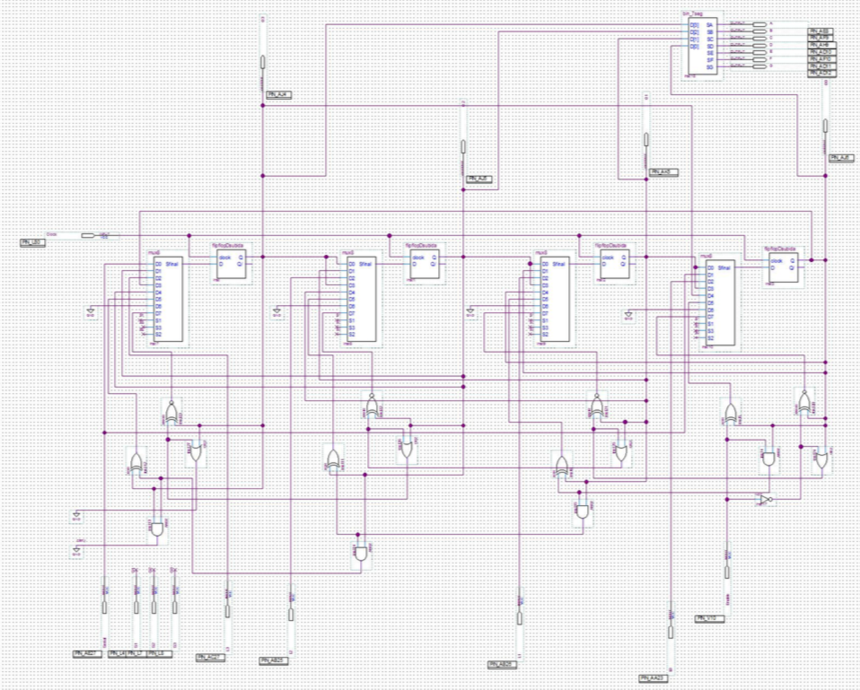

# Register

OVERVIEW
--------------------------------------------------
The purpose of this project was to implement a 4 bit register for the [Digital Systems] course. It was made at the Computer Science undergraduate program from University of São Paulo (ICMC - USP).

PROJECT
--------------------------------------------------
This register can execute the following functions:
	* Load (Parallel Load)
	* Shift (Left and Right)
	* Rotate (Left and Right)
	* Increment
	* Decrement
	* Count



HOW TO COMPILE
--------------------------------------------------
The game was made using Quartus software along with an Altera Cyclone II DE2-70 FPGA.

```bash
	1. Install Quartus software.
	2. At the end of Quartus configuration wizard, select Altera Cyclone II DE2-70 FPGA.
	3. Open the file `Registrador/Register.qpf` and compile the project.
```
CREDITS
--------------------------------------------------
- Frederico O. Sampaio
- Tiago Leite
- Wesley Tiozzo

MORE INFO
--------------------------------------------------
* Please check the file `project report.pdf` to view the code and know more about this project.
